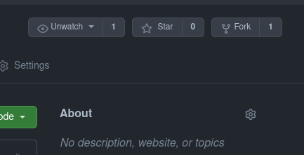
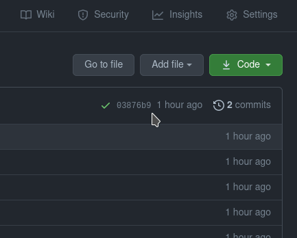
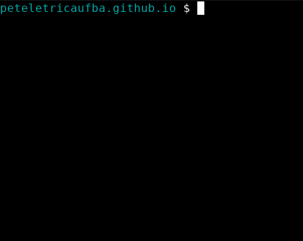
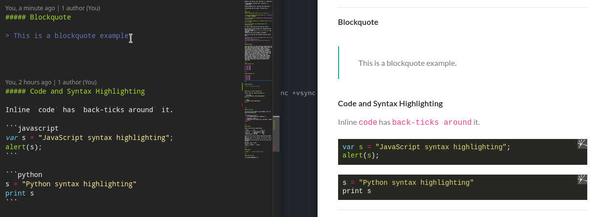
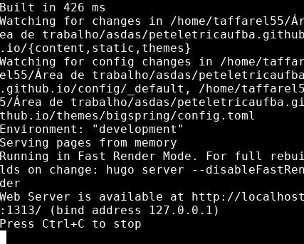

<!-- <h1 align="center" id="site-do-pet">
  <br>
  <a href="#"></a>
  <br>
  Site do PET Elétrica
  <br>
</h1>  LOGO DUPLICADA?????-->

<!---Esses são exemplos. Veja https://shields.io para outras pessoas ou para personalizar este conjunto de escudos. Você pode querer incluir dependências, status do projeto e informações de licença aqui--->


<center>

</center>

> Repositório com os arquivos do site do PET Elétrica, sinta-se a vontade para sugerir edições assim como utilizar o template do site.

### Ajustes e melhorias

O projeto ainda está em desenvolvimento e as próximas atualizações serão voltadas nas seguintes tarefas:

- [x] 20/08: Definição do sitemap, corpo das páginas e migração do WP
- [ ] 27/08: Edições no template, se necessário e ajustes nos arquivos do post
- [ ] 03/08: Finalizações das páginas.
- [ ] Pepinos futuros ainda não previstos...

## 💻 Pré-requisitos

Antes de começar, verifique se você atendeu aos seguintes requisitos:
<!---Estes são apenas requisitos de exemplo. Adicionar, duplicar ou remover conforme necessário--->
- Você tem instalado o `git` e o `hugo`
- Você seguiu a gente no [Instagram](https://www.instagram.com/peteletricaufba/) :laughing:

Para verificar se você tem instalado o `hugo` e o `git` execute os comandos a seguir:

```
git --version
```

```
hugo version
```

Caso não tenha algum dos requisições, siga os passos abaixo:

## 🚀 Instalando os requisitos

Para instalar o requisitos, execute os comandos:

### Git

```bash
# ---------------- Linux ----------------
brew install git
# ou 
apt-get install git       # Debian
pacman -Syu git           # Arch
dnf install git           # RPM-based
pkg_add git               # OpenBSD

# --------------- Windows ---------------
choco install git

# ----------------- Mac -----------------
brew install git
```

- Para mais detalhes sobre a instalação do `git` no Linux, [clique aqui](https://git-scm.com/download/linux).
- Para mais detalhes sobre a instalação do `git` no Windows, [clique aqui](https://git-scm.com/download/windows).
- Para mais detalhes sobre a instalação do `git` no Mac, [clique aqui](https://git-scm.com/download/mac).

### Hugo

```bash
# ---------------- Linux ----------------
brew install hugo
# ou 
sudo apt-get install hugo # Debian
sudo pacman -Syu hugo     # Arch
sudo dnf install hugo     # RPM-based
doas pkg_add hugo         # OpenBSD

# --------------- Windows ---------------
choco install hugo-extended -confirm
# ou
scoop install hugo-extended

# ----------------- Mac -----------------
brew install hugo
# ou
port install hugo
```

Para mais detalhes sobre a instalação do `hugo`, [clique aqui](https://gohugo.io/getting-started/installing).

## ☕ Editando o Site do PET Elétrica

Para editar o Site do PET, siga estas etapas:

1. Faça uma bifurcação do Site do PET para sua conta:

<center>

</center>

2. Baixe o Site do PET para uma pasta no seu computador, extraia e abra a pasta.

<center>

</center>

Ou insira os comandos abaixo:

```python
# Para baixar o zip e extrair:
git clone https://github.com/PETEletricaUFBA/peteletricaufba.github.io.git
# Para entrar na pasta:
cd peteletricaufba.github.io/
```

3. Execute o Site do PET no seu computador.

<center>

</center>

Deixe esse terminal aberto. Se tudo der certo, você vai ver o site neste link: [http://localhost:1313](http://localhost:1313)

4. Faça mudanças no site editando os arquivos da pasta `/content` e veja as alterações em tempo real

<center>

</center>

5. Quando estiver tudo pronto, feche o servidor local naquele terminal apertando `Ctrl+C` e gere as páginas do site!

```python
# Para gerar as páginas:
hugo -D
```

<center>

</center>

Os arquivos estáticos do site serão gerados na pasta `/docs`.

> Teve algum problema com algum passo anterior? [Clique aqui](https://github.com/PETEletricaUFBA/peteletricaufba.github.io/issues/new) para reportar um problema.

<h2 id="contribuir">📫 Contribuindo para o Site do PET</h2>

<!---Se o seu README for longo ou se você tiver algum processo ou etapas específicas que deseja que os contribuidores sigam, considere a criação de um arquivo CONTRIBUTING.md separado--->
Contribuições são o que tornam a comunidade de código aberto um lugar incrível para aprender, inspirar e criar. Todas as contribuições que você fizer são muito bem vindas!

Se quiser "fortalecer" aí sugerindo correções de ortografia ou erros no site, pode abrir o pull request que iremos amar!! :heart_eyes:

> Se tiver uma contribuição rápida que não envolve código, conteúdo ou quiser reportar algum problema sem ter que propor mudanças [clique aqui](https://github.com/PETEletricaUFBA/peteletricaufba.github.io/issues/new)

### Caso contrário, siga estes passos

1. Bifurque este repositório.
2. Crie um branch: `git checkout -b correcaoBlog`.
3. Adicione suas edições para próximo commit: `git add .`
4. Faça suas alterações e confirme-as: `git commit -m 'Edição no código do post sobre BOT'`
5. Especifique um novo repositório upstream remote que será sincronizado com a bifurcação: `git remote add upstream https://github.com/PETEletricaUFBA/peteletricaufba.github.io.git`
6. Envie para o branch original: `git push --set-upstream origin correcaoBlog`
7. Crie a solicitação de pull através do link que aparecer no terminal.

### Muito complicado tudo que ta aí em cima?

Como alternativa do procedimento anterior, veja o passo a passo com imagens e explicações mais detalhadas de como propor mudanças:

1. [Como bifurcar e clonar um repositório Github](https://docs.github.com/pt/github/getting-started-with-github/quickstart/fork-a-repo)
2. [Como criar uma bifurcação para propor mudanças](https://docs.github.com/pt/github/collaborating-with-pull-requests/proposing-changes-to-your-work-with-pull-requests/creating-and-deleting-branches-within-your-repository)
3. [Como propor de mudança através de uma bifurcação](https://docs.github.com/pt/github/collaborating-with-pull-requests/proposing-changes-to-your-work-with-pull-requests/creating-a-pull-request-from-a-fork)

## 🤝 Pessoas colaboradoras

Agradecemos às seguintes pessoas que contribuíram para este projeto:

<table>
  <tr>
    <td align="center">
      <a href="https://github.com/taffarel55">
        <br>
        <sub>
          <b>Maurício Taffarel</b>
        </sub>
      </a>
    </td>
    <td align="center">
      <a href="https://github.com/freedxmgxd/">
        <br>
        <sub>
          <b>Joelton Júnior</b>
        </sub>
      </a>
    </td>
    <!--
    <td align="center">
      <a href="#">
        <br>
        <sub>
          <b>Mark Zuckerberg</b>
        </sub>
      </a>
    </td>
    <td align="center">
      <a href="#">
        <br>
        <sub>
          <b>Steve Jobs</b>
        </sub>
      </a>
    </td>
    -->
  </tr>
</table>

## 😄 Seja um das pessoas contribuidoras<br>

Quer fazer parte desse projeto? Proponha mudanças seguindo este [passo a passo](#contribuir). Fazer

Ah, fique a vontade para editar este `README.md` te adicionando à lista de pessoas contribuidoras.

## 📝 Licença

Esse projeto está sob licença. Veja o arquivo [LICENÇA](LICENSE) para mais detalhes.

[⬆ Voltar ao topo](#site-do-pet)<br>
