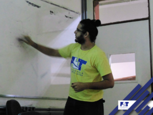

No dia 28 de fevereiro o PET Elétrica esteve presente no evento do PET Pedagogia, na FACED (Faculdade de Educação da UFBA).

A proposta principal é apresentar a UFBA para os estudantes de escolas públicas da região. O petiano Manoelito Filho (@manfilho) falou sobre a realidade da engenharia, da Politécnica, sobre a importância da Matemática e da Física e motivou bastante o público em ingressar na UFBA.

O evento contou com uma semana de minicursos e apresentações, e no final, 30 bolsas do cursinho Grandes Mestres serão destinadas a estudantes que realmente mostraram interesse em ingressar em um curso superior e vivem em algum nível de vulnerabilidade social.

