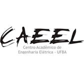

Está acontecendo um debate sobre os estágios curriculares do curso, a Congregação passou a bola para o Colegiado dos cursos decidirem como encarar a matéria. O Posicionamento do CAEEL em relação as novas medidas de estágio para o Colegiado, como discutido nas últimas reuniões:

O Centro Acadêmico de Engenharia Elétrica da UFBA, em reunião no dia 11/05/2018, entrou em consenso para demandas de alunos e alunas que conseguirão estágio para os próximos semestres: Possibilidade de trancamento, mesmo fora do prazo, de até 50% das disciplinas matriculadas no semestre, com prazo de até um mês após o início do estágio, sem necessidade de aprovação em reunião do Colegiado. Flexibilização para alunos e alunas que vieram de curso técnico e queiram estagiar a partir do 3º semestre, entretanto, o critério de passar em Circuitos I nos contempla. Em relação a avaliação discente após ingresso no estágio, precisamos conversar em reunião, porém, a representação é a favor desta avaliação de forma que a não renovação possa ser executada em casos de reprovações demasiadas.

Júlia Carvalho escreveu uma carta sobre o tema, [confira aqui](https://docs.google.com/document/d/117jCYYv3FOIebDuEJTu6yRJKZViYGTTw95jHBYi2OUw/edit?usp=sharing).

Muita coisa foi discutida no grupo no WhatsApp, o [link do grupo está aqui](https://chat.whatsapp.com/EoURD6mMTaiBeTOb5BPoW9).

Entretanto, a posição do Centro Acadêmico será decidida em reunião, sempre às sextas-feiras às 13hrs, na sede do CAEEL (do lado da xerox da Poli)
