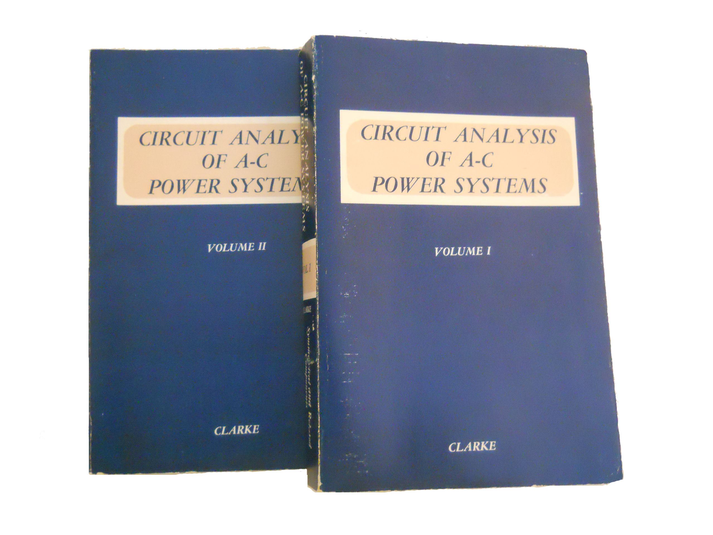
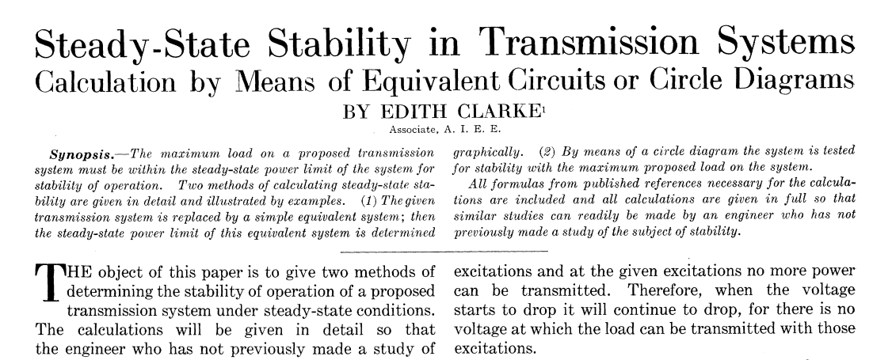

Quantas engenheiras que mudaram a história da ciência você conhece?

Há tempos a engenharia é considerada uma área majoritariamente masculina e fazer sucesso nessa carreira como mulher nunca foi algo fácil, até nos dias atuais.

Edwiges Hom’meil, Enedina Marques, Victória Rossetti, Hedy Lamarr, Emily Roebling, Aprille Ericsson, entre tantas outras, quebrando barreiras e preconceitos, foram pioneiras na engenharia e abriram espaço para a atuação de outras mulheres na área.

E quando falamos de pioneirismo feminino na Engenharia Elétrica, não podemos deixar de mencionar **Edith Clarke**, um modelo de inspiração.

Ela pode ter sido professora de Matemática e Física, estudante de Engenharia Civil, mas foi na Engenharia Elétrica que Edith Clarke fez seu nome como a primeira mulher a se formar engenheira eletricista no MIT, em 1918.

## Antes da Engenharia Elétrica

“Eu sempre quis ser engenheira, mas sentia como se mulheres não devessem estudar coisas como engenharia.” — Edith Clarke ao The Dallas Morning News

Seguir com os estudos em uma universidade já era algo incomum para uma mulher da época, mesmo assim, ela obteve seu bacharelado em Matemática e Astronomia pelo Vassar College, em Nova York.

Após isso, trabalhou alguns anos como professora de Matemática e Física até, em 1911, ingressar no curso de Engenharia Civil, na Universidade de Wisconsin, Madison.

Enquanto cursava Engenharia Civil, começou a trabalhar na _American Telephone and Telegraph_ (AT&T) como Assistente de Informática. Era o que acontecia com mulheres que possuíam grande conhecimento na área de Matemática, acabavam virando os “computadores humanos”.

Trabalhando na AT&T, ela teve contato com a Engenharia Elétrica e já se apaixonou. Assim, decidiu largar o curso de Engenharia Civil e ingressar no curso de Engenharia Elétrica do Instituto de Tecnologia de Massachusetts (MIT), se formando em 1918.

## General Eletric e a Calculadora Clarke

Com dificuldade de arranjar emprego como engenheira eletricista, aceitou emprego na General Eletric (GE) como computador, não sendo reconhecida como engenheira por ser mulher até 1922, quando se tornou a primeira engenheira eletricista empregada nos EUA, na mesma empresa.

Durante o período que trabalhava como computador, em 1921, desenvolveu a [**Calculadora Clarke**](https://patents.google.com/patent/US1552113A/en), calculadora gráfica usada para resolver problemas na linha de transmissão de energia. O dispositivo resolvia equações envolvendo corrente, tensão e impedância na linha até 10 vezes mais rápido que os métodos anteriores.

Já com o emprego de engenheira, Edith lecionava aos engenheiros da GE e suas notas de aula se tornaram um livro **“Circuit Analysis of A-C Power Systems”**, publicado em 1943. Essa obra foi usada por muito tempo como referência para engenheiros e alunos de Engenharia Elétrica na área de potência.

 “Circuit Analysis of A-C Power Systems”, volumes 1 e 2"
## Artigos no AIEE

Edith Clarke fez parte do American Institute of Electrical Engineers (AIEE), precursora do Institute of Electrical and Electronic Engineers (IEEE), e em 1926 foi a primeira mulher a apresentar um artigo ao Instituto, [**“Steady-State Stability in Transmission Systems Calculation by Means of Equivalent Circuits or Circle Diagrams”**](https://ieeexplore.ieee.org/document/5061206).

 Primeiro artigo publicado por Edith Clarke

Mais tarde, ainda teve dois artigos premiados como melhor do ano pelo AIEE. Também foi a primeira mulher a receber o título de Fellow pelo mesmo Instituto, em 1948, título reservado para membros com realizações extraordinárias.

## Primeira Professora de Engenharia Elétrica

Em 1947, após sua aposentadoria, a convite da Universidade do Texas, Austin, tornou-se a primeira professora de Engenharia Elétrica dos EUA. Enquanto professora, publicou o segundo volume do seu livro em 1950.

Durante seu período como professora, ainda foi reconhecida pela Society of Women Engineers, ganhando o prêmio Society of Women Engineeers Achievement Award em 1954, principal prêmio da organização.

[Ilustração de George Doutsiopoulos](https://www.artstation.com/georgedoutsiopoulos)

## "Não há uma demanda por engenheiras como há por médicas; Mas sempre há demanda por qualquer um que possa fazer um bom trabalho" — Edith Clarke, 1948.

* * *

### Quer ficar ligado nos nossos novos artigos?

Cadastre-se para não perder mais!
