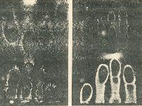
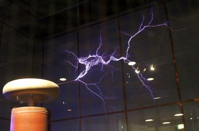
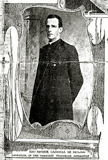
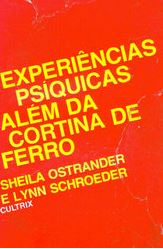
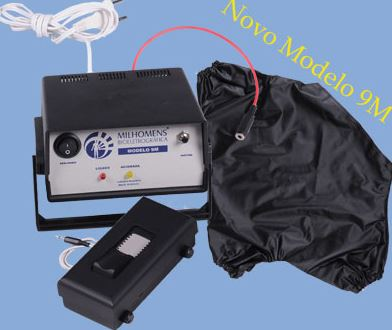
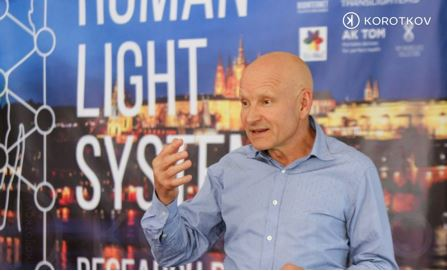

**_“Nunca pontifique nada, pois ainda estamos muito longe de tudo conhecer” – Newton Milhomens_**

Você já ouviu falar sobre os termos **perianto**, **kirliangrafia** ou **bioeletrografia**? Há tempos que esses termos são discutidos na área da saúde e engenharia. Esse tema, se não muito, é um pouco curioso. Vamos entender esse mistério?!

Esta técnica nos leva para o ano de 1777, quando Georg Christoph Lichtenberg, primeiro professor de física experimental na Alemanha, registrou eletrografias ou “efluviogramas” através da estimulação de pó fino utilizando a eletricidade estática e faísca elétrica. Estas imagens só puderam ser gravadas em 1839, pelo médico francês chamado Henry Baraduc com a ajuda do processo Daguerrotipo – o primeiro desenvolvimento fotográfico a ser anunciado e comercializado ao grande público – e podem ser visualizadas na Figura 1. Apesar das experiências e resultados interessantes, o médico francês não conseguiu despertar interesse dos cientistas da época e logo seus métodos caíram no esquecimento.

_Figura 1 – Eletrografias ou efluviografias de Baraduc_

No ano de 1880, 41 anos depois, nos EUA, Nikola Tesla mostrou publicamente a aura luminosa que aparecia ao redor de qualquer corpo quando este era exposto a um campo eletromagnético de alta voltagem e de alta frequência. Contudo, considerou esse efeito mera curiosidade e não deu continuidade à pesquisa. No futuro, essa aura luminosa foi denominada como “**EFEITO CORONA**” (Figura 2).

_Figura 2 – Efeito tesla_

No Brasil, no ano 1904, em Porto Alegre (RS), o padre, cientista e inventor brasileiro Landel de Moura (Figura 3), precursor do telégrafo sem fio, da telefonia sem fio e do emissor das ondas de rádio inventou uma máquina que chamou de “Máquina de Eletrofotografia” na qual era possível registrar a aura luminosa que aparecia em torno dos corpos e a batizou de “Perianto”. Contudo, por pertencer à igreja católica romana e devido ao fato de que o “Perianto” poderia ser confundido com o “Perispírito”, de nascente espírita, Landel foi combatido pela igreja e teve a sua máquina confiscada. Infelizmente, faleceu em 1928 sem receber qualquer reconhecimento ou apoio para as suas invenções, sendo taxado como louco e de ter realizado pacto com o diabo.

_Figura 3 – Fotografia do padre no jornal New York Herald, com a legenda: “Reverendo Padre Landel de Moura, inventor do aparelho de telefone sem fio”._

Trinta anos depois, em 1939, o eletrotécnico russo, Semyon Davidovich Kirlian, na antiga União Soviética, consertava equipamentos hospitalares de alta voltagem quando percebeu que a interação entre fraquíssimas correntes elétricas e altas tensões produzia uma aura luminosa em volta dos corpos. Kirlian e sua esposa, Valentina, passaram toda a sua vida pesquisando sobre o assunto (Figura 4). Contudo, só em 1970, devido ao livro “Descobertas Psíquicas Atrás da Cortina Férrea”, de S. Ostrander e L. Schroeder (Figura 5), o trabalho dos Kirlian foi reconhecido, iniciando assim a atual fase de pesquisas nessa área que, a princípio, recebeu o nome de Kirliangrafia.

_Figura 4 – Fotografia de Semyon D. Kirlian e sua esposa Valentina K. Kirlian_

_Figura 5 – Descobertas Psíquicas Atrás da Cortina Férrea. Editora Cultrix, 3ª Edição, 1980._

Entre 1970 e 1980 aconteceu um movimento de construção das “**Máquinas de Kirlian**” e inúmeras pesquisas sistemáticas para entender o “**Efeito Kirlian**” e suas possíveis aplicações. Por conseguinte, entre os anos de 1983 e 1986, surgem os padrões de máquinas expoentes da pesquisa científica na área da Kirliangrafia. Prof. Dr. Ioan Florin Dumitrescu, na Romênia, Peter Mandel, na Alemanha, Newton Milhomens, no Brasil, A. Lerner, na França e H. Oldfield, na Inglaterra. Cada um desses pesquisadores tinham o seu próprio padrão de máquina, porém originados na mesma fonte de pesquisa, do casal Kirlian. Na Figura 6 é possível visualizar a máquina desenvolvida por Newton Milhomens.

_Figura 6 – Máquina padrão Newton Milhomens (Brasil)_

Pelo fato do efeito observado se tratar de uma aura luminosa fascinante, discussões voltadas para o espiritismo, saúde mental e saúde física eram recorrentes. É possível constatar isso observando-se as pesquisas publicadas pelo mundo. É durante este período de 1987 a 1995, que há o crescimento exponencial de artigos científicos, teses de pós-graduação e centenas de livros publicados, em diversos países, inclusive no Brasil, como:

- No Brasil, na revista do Hospital das Forças Armadas, o artigo _“Diagnóstico Oncológico Kirliangráfico”_, dos Drs. Hélio Grott e Júlio Grott, afirma que era possível diagnosticar a existência de câncer – de qualquer natureza – a partir da observação dos detalhes da Kirliangrafia em seres humanos;
- Na Inglaterra, a Dra. Rosemary Steel, pioneira na pesquisa Kirliangráfica, utiliza a máquina de Kirlian do padrão Peter Mandel e apresenta a _“Pesquisa Kirliangrafica com pacientes sofrendo de enxaqueca”_;
- Também no Brasil, o Dr. Manoel Augusto Sperb Bacellar apresenta o trabalho _“Resultados da utilização da kirliangrafia no dia a dia em clínica psiquiátrica”_;
- Na Alemanha, o Dr. Peter Mandel, engenheiro e físico, realiza pesquisas tirando kirliangrafias para diagnosticar problemas de saúde orgânica, por meio dos pontos da acupuntura chinesa.

Em 1995, com o intuito de sistematizar o efeito Kirlian, na Rússia, o Dr. Konstantin Korotkov, PhD em física, (Figura 7) liderando uma equipe de pesquisadores da Universidade Estatal de São Petersburgo chegou no modelo kirliangráfico. Este modelo explica muito bem tudo que se pode notar no efeito e foi considerado como sendo a mais completa explicação da kirliangrafia até hoje apresentada. Ele e a sua equipe chegaram à conclusão de que o halo luminoso que aparece em torno dos corpos, numa foto Kirlian, é a visualização da ionização dos gases e vapores (“Gás Discharge Visualization”) através da exposição a descarga de alta voltagem e alta frequência nas máquinas de Kirlian. No decorrer desta pesquisa, no ano de 1999, a técnica da Kirliangrafia foi reconhecida pelo Ministério da Saúde da Federação Russa e, no ano 2000, pela Academia de Ciências da Rússia, sendo recomendada nas instituições de saúde como instrumento auxiliar de diagnóstico oncológico e psicológico.

_Figura 7 –  Dr. Konstantin Korotkov_

Atualmente, as pesquisas sobre a Kirliangrafia, em sua maioria, ainda seguem na área da bioenergia humana, contudo, cada vez mais apresenta-se em outras aplicações. Isto pode ser exemplificado pela a linha de pesquisa explorada no canal do Youtube “Plasma Channel”, que tenta comprovar a eficácia da máquina de kirlian na esterilização instantânea das mãos. O vídeo com mais explicações pode ser encontrado no link: [https://www.youtube.com/watch?v=y61ulskoGnI](https://www.youtube.com/watch?v=y61ulskoGnI).

# MistériosdaEngenharia #Tecnologia #Pesquisa

### Quer ficar ligado nos nossos novos artigos?

Cadastre-se para não perder mais!
