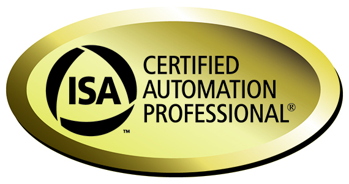

Camila Cancio é formada em Engenharia Elétrica pela faculdade Área1 – Faculdade de Ciência e Tecnologia em Salvador-BA além de possuir MBA em Gerenciamento de Projetos pela FGV, pós-graduação em Engenharia de Processos Petroquímicos pela UFRJ, Universidade Federal do Rio de Janeiro e pós-graduação em Engenharia de Segurança do Trabalho pela UNIFAL, União de Faculdade de Alagoas.

Fora sua rica formação, ainda possui duas certificações internacionais: PMP (_Project Management Professional_) do PMI (_Project Management Institute_) e CAP (_Certified Automation Professional_) da ISA (_International Society of Automation_), tendo destaque nesta última por ser a primeira e única mulher a conquistar essa certificação no Brasil. Possui também 14 anos de experiência na área de automação industrial, tendo atuado em empresas como Petrobrás e Yokogawa.

Atualmente trabalha como Engenheira de Automação Industrial Sênior da planta de Químicos 1 da Braskem na Bahia.

Confira nossa entrevista!

 Certificação internacional mais reconhecida e respeitada da área de Gerenciamento de Projetos

 Certificação internacional para profissionais de Automação

**1\. Quais foram suas motivações para escolher essa área de atuação e buscar suas certificações internacionais?**

**Camila:** Eu sempre tive afinidade com matemática e tinha a certeza que iria cursar algo na área de exatas. Pensei em ir pelo lado da Ciência da Computação no início, mas por influência do meu pai acabei cursando Engenharia Elétrica. Perto de me formar no curso de graduação, comecei a minha busca por estágio e uma amiga de faculdade me indicou para um processo seletivo na Automind, uma empresa integradora que trabalha com projetos, para atuar com Automação Industrial. Minha experiência com TI durante a graduação me favoreceu na entrevista e acabei sendo contratada. Conheci o mundo da Automação Industrial, fiquei encantada, achei que era uma carreira promissora e desde então, sempre segui atuando na área. As certificações internacionais foram consequências da minha trajetória.

**2\. No início da carreira, você já planejava obter todas os diplomas e certificações que conquistou ou isso foi acontecendo espontaneamente?**

**Camila:** Isso foi acontecendo espontaneamente. Dentro da minha experiência adquirida, foi surgindo a vontade e necessidade de buscar por mais conhecimento. Eu também sempre quis mostrar um diferencial no mercado e isso me incentivou bastante.

**3\. Qual foi a sensação de ter sido a primeira brasileira a obter certificação internacional da ISA?**

**Camila:** A primeira sensação foi de alegria, por ter passado no exame na primeira tentativa, após tanto estudo e sacrifício. A segunda sensação foi de surpresa. Quando eu prestei o exame, jamais poderia imaginar que eu seria a primeira mulher brasileira com esse título. Meu esposo viu através das redes sociais uma postagem noticiando o acontecimento e minha “ficha” só caiu quando entrei em contato com a ISA e eles confirmaram a informação. Em seguida veio o sentimento de orgulho, pois várias mulheres, estudantes e profissionais me procuraram para dar os parabéns, dizer que me viam como inspiração e me pediam dicas para a carreira e para também obter a certificação CAP. Nesse momento eu vi que representatividade realmente importa, que muitas mulheres usariam o meu exemplo como inspiração e se sentiam capazes.

**4\. De todas as várias conquistas que obteve em sua carreira, de qual você mais se orgulha?**

**Camila:** A certificação CAP, sem dúvida. Foi a mais trabalhosa e gratificante.

**5\. Qual foi a maior dificuldade que você enfrentou durante seu trajeto? Em algum momento sentiu que, por ser mulher, foram impostas barreiras maiores para você?**

**Camila:** Eu conheci o desemprego em 2008, isso me fez ficar fora do mercado de trabalho por 6 meses. Foi um momento bem difícil que fez a minha autoestima como profissional ficar baixa, mas aprendi que isso pode acontecer com qualquer profissional em um momento de crise e que devemos sempre levantar a cabeça e dar a volta por cima, sempre acreditando em nosso potencial.

O fato de ser mulher, algumas vezes dificultava o meu trabalho, e isso me fazia trabalhar duas vezes mais e até me comportar como “homem” para garantir o respeito e credibilidade.

No início da minha carreira eu também enfrentei algumas dificuldades com colegas de nível técnico que me olhavam como “ameaça” ao cargo deles, sendo que acredito que tem vaga para todos. Eu era confrontada e testada por eles nas minhas atividades, sendo cobrada a saber de tudo pelo simples fato de ser. Todos têm o seu papel e importância, técnicos, analistas, estagiários e engenheiros. Um não é mais importante que o outro.

**6\. Já foi tratada de forma diferente (positiva ou negativa) nos ambientes acadêmico e/ou profissional por ser mulher?**

**Camila:** Poucas vezes de forma negativa, mas infelizmente isso já aconteceu. Já fui excluída de um trabalho embarcado (em plataforma) por ser mulher. Já tive também o resultado do meu trabalho sendo questionado da confiabilidade por ser mulher e foi preciso um homem para validar a minha entrega, para então passar credibilidade. Porém, por outro lado (o positivo), já fui escolhida para liderar um trabalho pesado entre colegas de trabalho homens, justamente por eu ser uma mulher determinada e focada, que demonstra força e apresenta bons resultados. Já fui selecionada também para conduzir trabalhos mais complexos, por ser mulher, que tem fama de ser mais organizada.

**7\. Em algum momento da graduação você pensou em desistir? Se sim, por quê?**

**Camila:** Em vários momentos da vida, não só na graduação, já tive vontade de desistir. As dificuldades as vezes aparecem uma atrás da outra e faz você pensar que não vai conseguir, mas para isso eu sempre tinha ao meu redor: familiares, amigos, professores e colegas de trabalho, que me davam apoio. E também só o fato de olhar para trás e ver o quanto eu caminhei, fui capaz e venci, me fazia tirar a ideia de “desistir” rapidamente da cabeça e seguir em frente.

**8\. O que você diria para as meninas que têm interesse em engenharia, mas estão preocupadas com as dificuldades que podem encontrar quanto à não equidade de gênero?**

**Camila:** Cada vez mais a desigualdade entre homens e mulheres vem diminuindo. Eu sinto a diferença de quando comecei a carreira até hoje, muita coisa melhorou. As mulheres estão cada vez mais dominando o mercado de engenharia e mostrando que são capazes. As empresas vêm montando programas que fazem com que essa equidade de gênero se torne realidade. As mulheres que estão começando carreira, que estão estudando, vão se juntar a esse quadro de mulheres fortes na engenharia e fortalecer cada vez mais os nossos objetivos, direitos e destaques. Precisamos de vocês!

**9\. O que te motiva atualmente?**

**Camila:** O amor a profissão, os objetivos de vida, a minha família e os desafios do meu dia a dia, intrínseco da engenharia, que tira toda a monotonia e me dá mais energia.

**10\. Quais as suas próximas metas? Tem algum novo projeto em mente?**

**Camila:** Recentemente eu alcancei uma meta dentro da empresa que trabalho, que foi a mudança de função e de unidade. Agora as minhas metas atuais são mais pessoais do que profissionais. Porém, para futuro, pretendo continuar estudando, talvez um Mestrado, e buscando outras certificações.

### Quer ficar ligado nos nossos novos artigos?

Cadastre-se para não perder mais!
