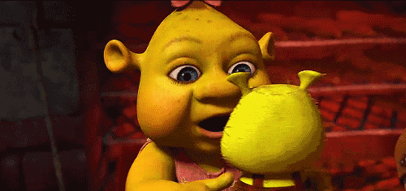

_“Ele pode ser um atrativo para empresas que estão procurando jovens para contratar”,_ afirma a supervisora de relacionamento com instituições de ensino do CIEE (Centro de Integração Empresa-Escola), Laura Alves.

Nada melhor que terminar o tão sonhado e desejado curso, não é mesmo?! Muitos estudantes se mantêm plenos nessa árdua tarefa até à reta final onde se defrontam com o temido Trabalho de Conclusão de Curso, o famoso TCC. Depois de quase cinco anos, ou mais, de muitas noites perdidas e estresses corriqueiros, o estudante, às vezes, termina dando diferentes níveis de importância ao seu trabalho final de curso. Contudo, esse comportamento é prejudicial, pois essa produção pode significar a abertura de uma porta para o mercado de trabalho, através de um novo emprego ou uma efetivação de estágio, além de futuras pós-graduações.

_"Um bom trabalho de TCC pode ser usado como portfólio do candidato a uma vaga de trainee ou emprego, valendo mencioná-lo no currículo. A avaliação se dará em função da relevância do tema do TCC para a atividade da empresa"_, afirma a supervisora de relacionamento com instituições de ensino do CIEE (Centro de Integração Empresa-Escola), Laura Alves.

### _O COMEÇO_

_“O TFG é o trabalho que vai sintetizar seu aprendizado na faculdade em relação à maturidade e autodidatismo. É uma atividade muito importante porque, por demandar um tempo muito grande do aluno, reflete sua dedicação e interesse. Além disso, um TFG bem desenvolvido pode promover abertura de portas, tanto em relação a empregos, quanto em relação a pós-graduações.”_ Danilo Costa, engenheiro eletricista formado na Universidade Federal da Bahia (UFBA).

Um bom Trabalho Final de Graduação (TFG) provém de muita dedicação e um bom acompanhamento, pois sem a supervisão de um especialista o trabalho pode fugir um pouco do que o aluno realmente quer elaborar. Esses documentos são de suma importância para a carreira acadêmica do graduando. Logo, a escolha do professor orientador deve ser feita com muito cuidado, analisando sempre em qual aspecto ele pode auxiliar. Por isso, deve-se ter uma organização prévia dos assuntos abordados. Uma possibilidade seria a criação de um mapa mental, no qual os tópicos e os subtópicos escolhidos possam ser interligados de uma maneira mais clara e direta.

_“Acredito que a primeira dificuldade encontrada para a realização deste trabalho é a escolha do tema e do orientador. Das pessoas que conversei sobre o TFG, a maioria passou por esse problema. No meu caso, eu sabia que queria fazer o trabalho na área de controle e automação, então procurei um orientador nesta área primeiro e depois decidimos o tema em conjunto.”_, diz Danilo.

### PEDRAS À VISTA NO CAMINHO

Outras grandes barreiras encontradas por estudantes que estão nesta etapa do curso são: a criação de uma rotina em prol do cumprimento dos prazos e construir uma monografia fiel a ABNT (Associação Brasileira de Normas Técnicas). Para a primeira, por conta de, na maioria das vezes, estarem com o estágio e o pensamento no mercado de trabalho, os estudantes terminam não planejando uma certa disciplina que se adeque à rotina. Portanto, a ideia de um planejamento prévio é fundamental para a produção de um excelente TCC. Para a segunda, uma das principais dificuldades está na parte das citações e das referências, por isso um conhecimento prévio sobre a ABNT, submissão de trabalhos em eventos e leituras de textos nesse formato são imprescindíveis para um bom aproveitamento do tempo e um melhor resultado.

_“Acontece também que, no primeiro semestre do TFG, 99% dos alunos desenvolvem apenas a proposta, e não começam a desenvolver o tema em si. Isso faz com que o segundo semestre seja um TFG intensivo para praticamente todos os alunos, e, de maneira geral, a consequência disso é redução na qualidade do trabalho por falta de tempo hábil para realização do mesmo.”_, complementa Danilo.

### DEPOIS DE PRONTO, HÁ MAIS ALGO A FAZER?

Além de ter um ótimo conteúdo, o Trabalho Final de Graduação deve ter uma boa apresentação diante da banca de avaliação. Impressionar os membros dela, tanto com sua desenvoltura quanto com a aplicabilidade dos resultados dos seu trabalho, possui grande relevância, pois os avaliadores além de garantirem a aprovação, poderão trazer um redirecionamento para o seu futuro, desde de um conselho para a continuação da pesquisa ou até uma indicação a uma vaga no mercado de trabalho. Então, trabalhar o poder de síntese e de crença na sua produção, através de participações em seminários e em outras apresentações, é imprescindível para a prática dessa habilidade.

O último ponto deste texto, porém não menos importante, é a oportunidade de construção da sua rede de _Network_. Através do contato com empresas atuantes na área ou acadêmicos de outras universidades com o conhecimento sobre o assunto, a monografia enriquece com informações e referências (maior credibilidade). Uma boa rede de contatos é essencial para a vida profissional, com possíveis retornos, direta ou indiretamente, no futuro.

### O ALÍVIO

_“Apesar das dificuldades e do longo tempo de desenvolvimento, o TFG simboliza a conclusão do curso superior e sua conclusão traz muita alegria e alívio para os estudantes.”_, conclui Danilo.

Um Trabalho Final de Curso pode se tornar uma experiência complicada por diversos motivos. No entanto, por meio das dicas e pontos citados acima, o caminho para o encontro do tão desejado diploma se tornará mais tranquilo, simples e sem muitas "pedras". Mais do que isso, o TFG se transforma em uma oportunidade magnífica capaz de ampliar a acessibilidade de uma realização profissional!

REFERÊNCIAS

1. [5 dicas para uma apresentação de TCC](http://www.smartalk.com.br/5-dicas-para-uma-apresentacao-de-tcc/)
2. [Como fazer uma apresentação de TCC](https://blog.mettzer.com/como-fazer-uma-apresentacao-de-tcc/)
3. [7 dicas para se dar bem na apresentação de TCC](http://noticias.universia.com.br/destaque/noticia/2011/12/02/894848/7-dicas-dar-bem-na-apresentaco-tcc.html)
4. [7 dicacs para arrasar no TCC](https://www.educamaisbrasil.com.br/educacao/noticias/7-dicas-para-arrasar-no-tcc)
5. [Os beneficios profissionais de uma monografia bem elaborada](https://trabalhos-prontos-escolares.com/blog/os-beneficios-profissionais-de-uma-monografia-bem-elaborada/)
6. [Dicas TCC](https://www.iespe.com.br/blog/dicas-tcc/)
7. [Significado TCC](https://www.significados.com.br/tcc/)

[Leia mais sobre o autor](http://www.peteletrica.eng.ufba.br/2017/matheus-carvalho-handley-santos/)
