Os _bots_ ou robôs virtuais são aplicações computacionais programadas para realizar, de forma autônoma, uma tarefa previamente determinada. Esses programas podem ser usados em diversos contextos e para finalidades distintas. Com isso, essa publicação apresenta o desenvolvimento de um robô virtual capaz de facilitar inúmeras atividades cotidianas.

Os _chatbots_ constituem uma das aplicações mais comuns para os _bots_. Eles têm sido cada vez mais usados em lojas virtuais para atendimento dos usuários. Trata-se de um robô previamente parametrizado e programado para interagir com um cliente, simulando uma conversa humana por meio de um chat. Dessa forma, o atendimento às requisições é simplificado, trazendo benefícios aos vendedores e para seus clientes.

O desenvolvimento de _chatbots_ pode ser feito baseado em instruções pré-definidas ou por Inteligência Artificial (IA). O primeiro modo é mais limitado, pois apresenta um vocabulário restrito, aumentando as dificuldades de interação com o usuário. Por outro lado, um _chatbot_ baseado em IA consegue estabelecer a comunicação de forma mais fluida, sem tantas limitações ou interferências humanas. Apesar do uso dos _bots_ trazer questionamentos sobre a substituição do trabalho humano e o aumento do desemprego, essas ferramentas tendem a facilitar a execução das tarefas, evitando a realização de tarefas repetitivas.

No contexto empresarial, a aplicação de _chatbots_ pode trazer benefícios, como aumento na velocidade de atendimento, interações simultâneas, redução de custos, maior disponibilidade para a realização de atendimentos, entre outros. Além de trazer facilidades ao ambiente corporativo por meio da desburocratização e automatização de processos, essa ferramenta computacional pode ser usada para a realização de tarefas individuais de forma simples e gratuita. Assim, mesmo sem conhecimentos prévios a respeito de linguagens de programação, é possível desenvolver um _bot_ capaz de enviar fotos, vídeos, textos, dados, entre outros.

## SUMÁRIO

1. ##### [CRIAÇÃO DE UM _BOT NO TELEGRAM_](#i1)

2. ##### [USANDO O _INTEGROMAT_](#i2)

3. ##### [CONECTANDO O BOT DO TELEGRAM AO SCENARIO](#i3)

4. ##### [CONECTANDO E CONFIGURANDO BLOCOS](#i4)

5. ##### [FORMATANDO OS DADOS](#i5)

6. ##### [ADICIONANDO O _GOOGLE CALENDAR_](#i6)

7. ##### [AJUSTES FINAIS](#i7)

8. ##### [ETAPAS PARA O DESENVOLVIMENTO DA APLICAÇÃO](#i8)

9. ##### [CONCLUSÃO](#i9)

10. ##### [REFERÊNCIAS](#i10)

## CRIAÇÃO DE UM _BOT NO TELEGRAM_

Antes de começar a criar o robô virtual, é aconselhável definir qual o objetivo a ser alcançado através do _bot_. Para isso, é importante criar uma lista de funções que a aplicação deverá ser capaz de cumprir.

Há muitas formas distintas para desenvolver um _bot_. O _Telegram_ permite a criação de robôs virtuais de forma simples e rápida. Para facilitar esse procedimento, pode ser feito o uso da plataforma _Integromat_ a qual apresenta interface gráfica de fácil utilização, capaz de conectar o _bot_ a aplicativos e serviços, como _Facebook_, _Youtube_, _Discord_, _Tumblr_, _Instagram_, _Uber_, entre outros. Ressalta-se ainda que, com o uso dessa plataforma, não há a necessidade de codificação.

O _bot_ apresentado neste tutorial tem como função adicionar eventos na _Google_ Agenda sem a necessidade de fazer o login nos serviços da _Google_. Desse modo, para realizar o cadastro de eventos e tarefas através do _bot_, é necessário lhe fornecer instruções. A fim de cumprir com tal requisito, utiliza-se o serviço de aplicação de mensagens instantâneas _Telegram_. Por meio desse robô virtual consegue-se simplificar a pequenos passos uma atividade que é, por vezes, tediosa. Sem mais delongas, vamos partir para a criação do _bot_!

[Iniciando o uso do Botfather](images/postbot0.png) Iniciando a comunicação com o _Botfather_

Digite “_BotFather_” na barra de pesquisa do _Telegram_ e encontre a aplicação do _Telegram_ responsável pelo desenvolvimento de _bots_. Quando abrir o _chat_, clique em “Começar” ou digite _/start_. Quando a conexão com o “_BotFather_” for iniciada, digite _/newbot_ para criar o seu _bot_.

 Configurações iniciais do _bot_

Após criar o _bot_, dê-lhe um nome e o nome de usuário. Por conseguinte, o _BotFather_ lhe fornecerá um _Token_, responsável pela identificação do _bot_. Por último, copie o _token_ e mantenha ele em algum lugar de fácil acesso.

## USANDO O _INTEGROMAT_

Antes de dar prosseguimento à etapa anterior, crie uma conta no [_Integromat_](https://www.integromat.com/) , plataforma que permite a integração entre bots e diversos serviços. A primeira imagem que aparecerá depois do cadastro e login é a seguinte:

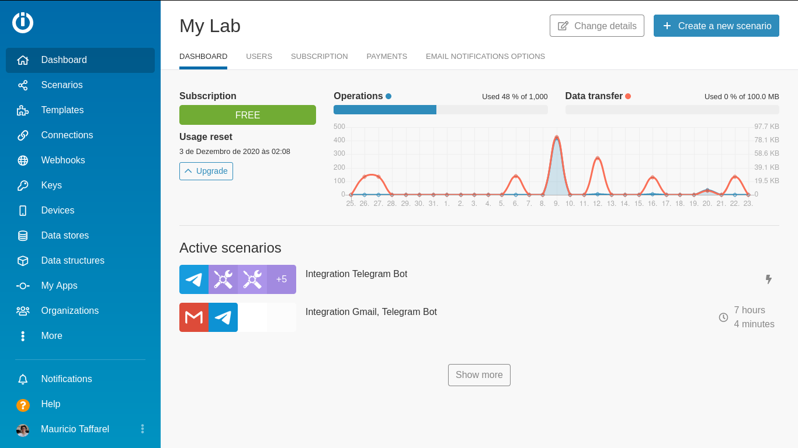 Página inicial do _Integromat_

Para criar uma nova aplicação, clique em _Create a new scenario_:

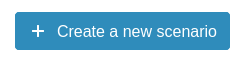Posterior a isso, a tela apresentará as opções de serviços que podem ser utilizados. No caso dessa aplicação, selecione apenas o _Telegram Bot_ e o _Google Calendar_ usando a barra de pesquisa. Em seguida, clique em _Continue_.

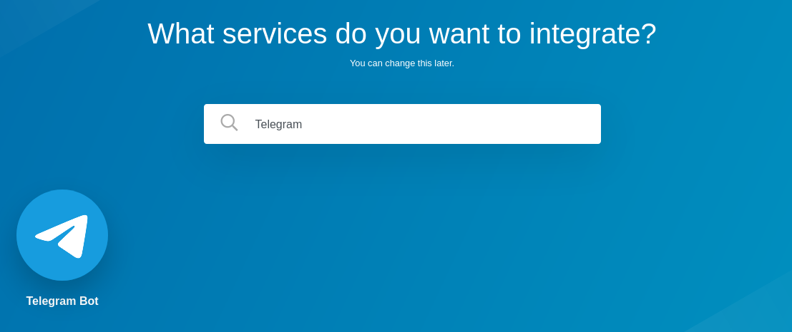 Barra de pesquisa para os serviços

Após escolher o _Google Calendar_ e o _Telegram_, clique em _Continue_. A primeira tela que aparecerá será a seguinte:

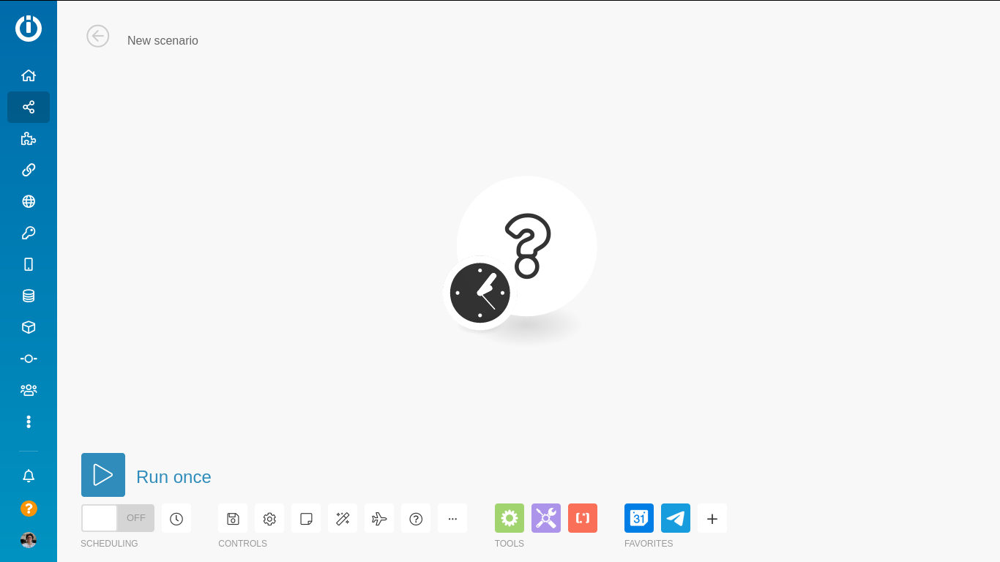 Seleção do primeiro programa

Como se pode visualizar na imagem acima, há um círculo com uma interrogação seguido de um relógio. Esse sistema será o _Trigger_ ou gatilho, responsável por perceber mudanças no processo e, com isso, realizar uma ação.

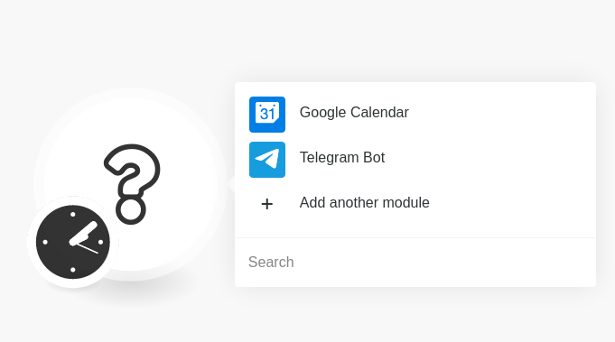 Escolha do programa a ser adicionado

No exemplo em questão, o gatilho será a mensagem enviada para o _bot_ pelo chat do _Telegram_. Assim, o primeiro bloco a ser escolhido é o _Telegram Bot_.

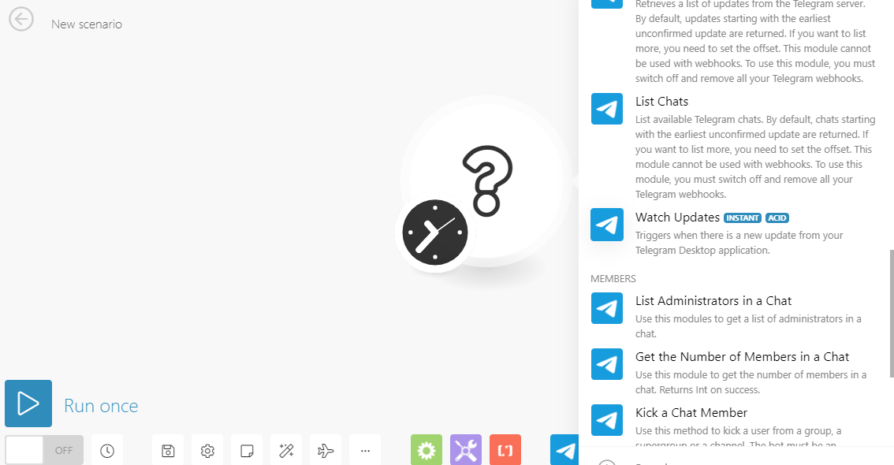 Configuração inicial do bloco _Telegram_

A tela seguinte será como a mostrada na imagem acima, entre as opções presentes, pressione _Watch Updates_. Isso deve ser feito para criar uma aplicação que funcione sem interrupções indesejadas. Caso essa escolha não fosse feita, a aplicação funcionaria em um tempo previamente definido pelo usuário na seção do relógio.

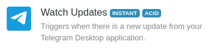

Esse bloco vai ativar o I_ntegromat_ sempre que houver alguma atualização.

## CONECTANDO O BOT DO TELEGRAM AO SCENARIO

A partir desse momento, é necessário realizar a conexão entre a aplicação no _Integromat_ e um _bot_ existente no _Telegram_.

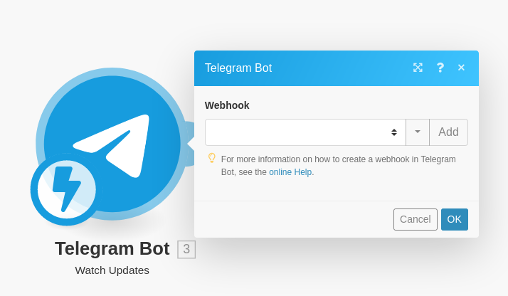 Conectando o _bot_ ao _Integromat_

Ao clicar nessa opção, inicia-se o processo de cadastramento do _bot_ criado anteriormente no _BotFather_. Esse passo tem início ao clicar em _Add_ e escolher um nome. Depois, deve-se clicar em _Add_ novamente para adicionar uma conexão com o _bot_.

 Adicionando o _token_ do _bot_

Em seguida, clique novamente no botão _Add_ que aparecerá nas próximas duas janelas. Com isso, será possível definir o nome da conexão no espaço _Connection Name_ e colocar o _Token_, obtido após a criação do _bot_, para que ele possa ser identificado.

Posterior a isso, clica-se em _Save_ para salvar a conexão estabelecida com o _bot_. Agora, é necessário criar ou deixar explícito para a aplicação a partir de qual evento ela deve atuar.

## CONECTANDO E CONFIGURANDO BLOCOS

Para explicitar sobre qual evento a aplicação deve atuar, aproxime o cursor do mouse do primeiro módulo e clique em _Add another module_.

O próximo passo será adicionar um outro módulo e conectar ao primeiro do _Telegram_. O próximo módulo a ser adicionado será o de _Tools_ (canto inferior esquerdo da tela).

Ao clicar em _Tools_, será aberta uma série de opções possíveis, como se pode visualizar na imagem abaixo. Será usado um bloco capaz de salvar valores em variáveis.

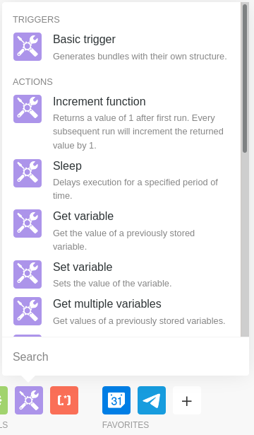 Adicionando o bloco de ferramentas

Como dito anteriormente, para fins de se armazenar o valor das variáveis, escolhe-se a opção Set _variable_. O passo seguinte busca criar um vetor com a mensagem do telegram enviada pelo usuário, de modo que os elementos do vetor serão separados por espaço, exemplo: Vamos super que a mensagem recebida pelo _bot_ seja:

festa 23/11/2020 15:40

Os elementos que devem ser salvos em um vetor são:

- festa
- 23/11/2020
- 15:40

Para fazer isso, conecte os dois blocos (Telegram ---> Tools):

 Conexão entre o bloco _Telegram Bot_ e o _Tools_

Depois de conectar os dois blocos, faz-se necessário configurar o bloco _Tools_ para que o objetivo almejado se concretize (separar as informações da mensagem em vetores separados por espaço).

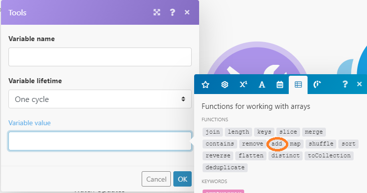

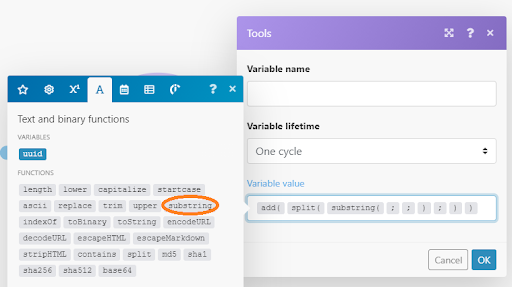

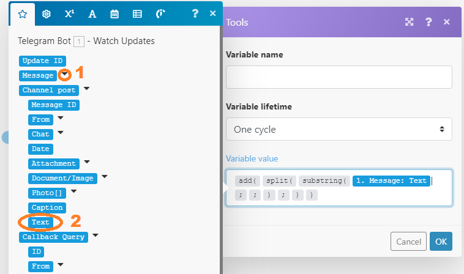

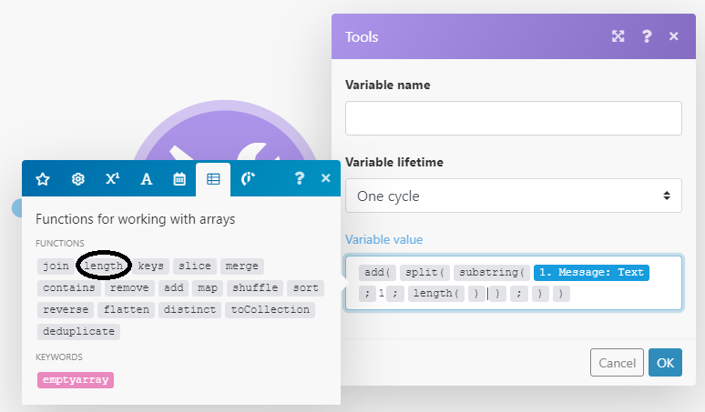

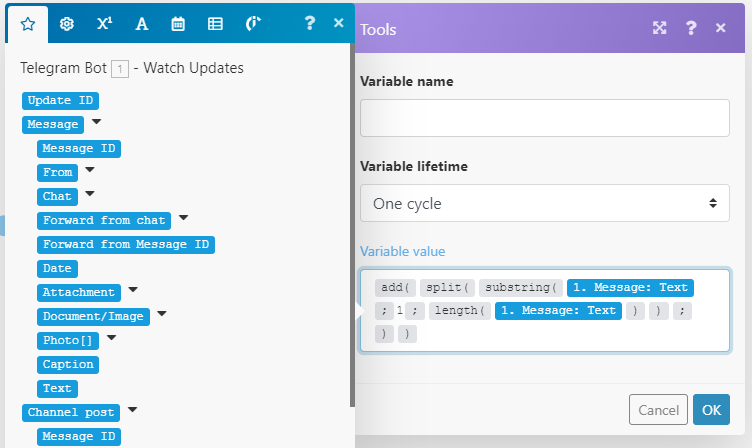

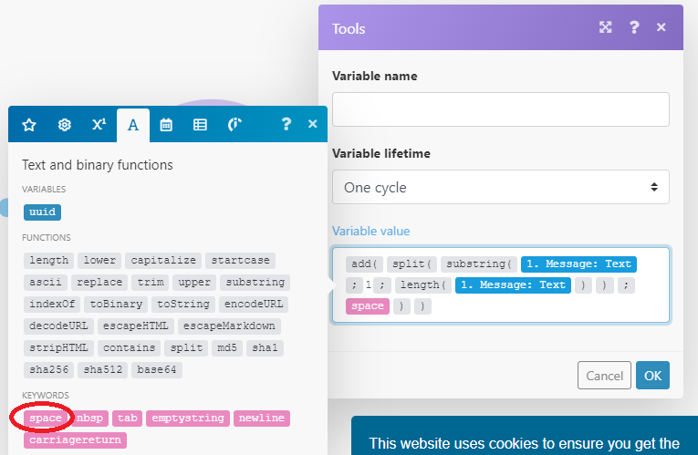

Por fim, altere o _Variable lifetime_ de _One cycle_ para _One execution_ e renomeie o _Variable name_ para Mensagem.

 Concluindo a configuração do bloco de ferramentas

Uma vez terminada a configuração do bloco _Set variable_ - _Tools_, é importante conectar esse conjunto a um bloco do _bot_ do _Telegram_ para que haja a percepção do efeito criado através do conjunto anterior.

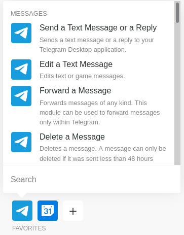 Realizando teste

Escolha a opção _Send Text Message or a Reply_ para que o _bot_ responda com uma mensagem de texto quando houver o gatilho.

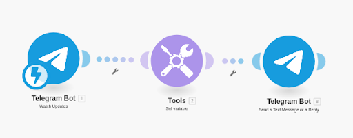 Conectando os blocos

O resultado é mostrado na figura acima após conectar o novo bloco do _Telegram Bot_. Para prosseguir com esse teste, configure o bloco de modo que se preencham os campos de _Chat ID_ e _Text_ como mostrado na figura abaixo:

 Configurando o bloco _Telegram_

Com a configuração feita, aperte o _OK_, salve a aplicação e clique em _Run Once_. A partir desse momento, você pode enviar mensagens para o _bot_ no _Telegram_. O _Run Once_ não permite que o _bot_ funcione para sempre, mas faz o _bot_ funcionar somente uma vez e depois a aplicação para (recomendado para a fase de testes da aplicação).

Uma vez clicado, o funcionamento pode ser visto no chat do _bot_ no _Telegram_, digitando um texto no seguinte formato:

/nomeDoEvento data hora

Caso ainda tenha dúvidas, siga o modelo mostrado na figura abaixo:

Assim, percebe-se como o bot respondeu conforme as configurações feitas previamente.(O robô virtual está salvando o primeiro elemento “cortarCabelo”, o segundo elemento “05/02/2021” e o terceiro “14:00h”, todos separados por vírgula.

O próximo passo é separar essa informação/elemento e salvar numa variável. O primeiro elemento é o nome do evento e, para separar e salvar em uma variável, o seguinte procedimento deve ser seguido:

É necessário adicionar um _Set variable_, o qual pode ser encontrado na aba de _Tools_, logo após o primeiro que já havia sido construído nessa aplicação. Para desfazer as conexões entre os blocos, clique com o botão direito e pressione _unlink_. Então, mova blocos e os ajuste desta maneira:

 Disposição dos blocos

Com a disposição dos blocos ajustada, é necessário configurar esse novo bloco _Set variable_ - _Tools_. Para isso, preencha-o com as informações presentes na figura abaixo.

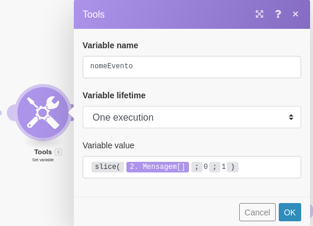 Configurando novo bloco de ferramentas

Por meio desse bloco, cria-se uma variável que armazena o valor resultante do primeiro elemento da informação anterior, ou seja, nomedoEvento. Caso haja dúvidas em relação a função _slice_, consulte a [referência](https://support.integromat.com/hc/en-us/articles/360005771833-Array-Function)  disponibilizada pelo suporte do próprio _Integromat_.

A função _slice_ recebe como parâmetro uma _string_ (palavra) e os índices que demarcam qual elemento a função deve armazenar. Como inicialmente só se deseja salvar o nome do evento, faz-se uso dos números 0 e 1. Isso se deve ao fato de que o elemento de índice zero é o nomedoEvento, o primeiro elemento é a data e o segundo elemento é o horário.

Antes de prosseguir para o próximo passo, a aplicação será testada. O último bloco do _Telegram Bot_ deve ser configurado de modo que o campo _Text_ apresente a seguinte informação:

 Configuração de texto do bloco _Telegram Bot_

Depois dessa configuração, salve a aplicação e aperte o botão _Run Once_ de novo. Posteriormente, envie a mensagem anterior “/cortarCabelo 05/02/2021 14:00” ao _bot_ e, se aparecer uma caixa de diálogo, clique em _listen for new_.

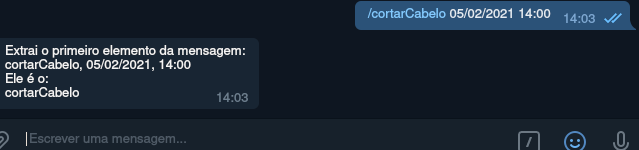

Após o entendimento sobre como extrair o primeiro valor, pode-se repetir o processo, de forma análoga, para extrair o segundo e o terceiro. Para isso, criam-se mais dois blocos _Set Variable_ de modo que a disposição física da nossa aplicação fique conforme a figura abaixo no _Integromat_.

 Disposição dos serviços

Para configurar os blocos _Set Variable - Tools_ seguintes, segue-se o mesmo procedimento realizado para armazenar o primeiro valor:

 Configuração do terceiro bloco de ferramentas

Em dataEvento colocamos os parâmetros 1 e 2 para armazenar a informação da data.

E, no último, colocam-se o 2 e o 3, objetivando armazenar a informação do horário do evento.

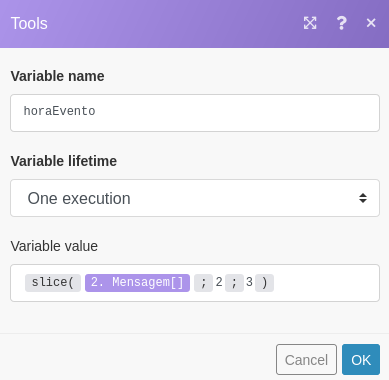 Configuração do quarto bloco de ferramentas

Ao finalizar a configuração de todos os blocos _Set Variable - Tools_, é necessário configurar novamente o bloco do _bot_. Alterando o conteúdo do campo _Text_ como mostrado na figura a seguir:

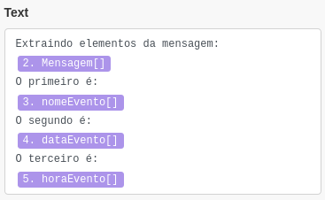 Configuração do último bloco _Telegram Bot_

Em seguida, salve a aplicação, aperte _Run Once_ e inicie a conversa com o _bot_ pelo _chat_ do _Telegram_.

A resposta esperada ao enviar “/cortarCabelo 05/02/2021 14:00” é a seguinte:

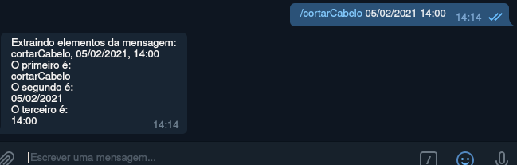

Isso demonstra que cada informação foi salva por três variáveis distintas. Ou seja, a mensagem foi subdividida em partes distintas as quais foram armazenadas em variáveis diferentes.

Antes de prosseguir, percebe-se que já foram feitas as seguintes etapas: configurou-se a aplicação para obter a mensagem fornecida pelo usuário através do _chat_ do _Telegram_, armazenando-a em blocos separados (nome do evento, data, horário).

Por último, após separar as informações, extraem-se os seus respectivos valores. Nesse momento, com o tratamento dos dados envolvidos no processo concluído, faz-se necessária a criação do evento. Em busca disso, é preciso colocar os valores de data e hora num formato específico aceito pelo _Google_ Agenda.

\[mes/dia/ano\]\[espaço\]\[hora-+fuso\]

Exemplo:

05/02/2021 14:00-03:00

Esta data pode ser lida como 2 de maio de 2021 às 14:00h no fuso horário GMT -3 (que é o fuso horário no Brasil)

Como colocar as informações em um formato específico? Para isso, novamente, cria-se mais um bloco _Set variable_. Este último bloco vai usar as variáveis horaEvento e dataEvento para criar uma nova variável com o formato adequado para o _Google_.

A disposição física dos blocos deve ser idêntica à mostrada na imagem abaixo:

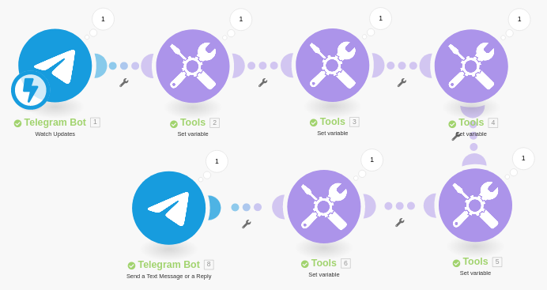 Disposição dos blocos

## FORMATANDO OS DADOS

Para que o funcionamento ocorra corretamente, o último bloco deve ser configurado desta forma:

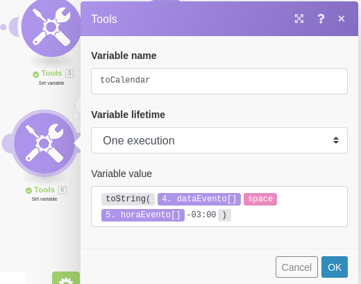 Configuração do último bloco de ferramentas

A função _to string_ converte os valores para o formato _string_ e, por meio desse bloco, há a adição de um espaço e do fuso horário referente à localização atual. Por fim, ao apertar _OK_, há o salvamento em uma variável _toCalendar_.

Novamente, retorne à conversa com o _bot_ e observe a diferença entre os formatos da mensagem anterior à conversão e presente:

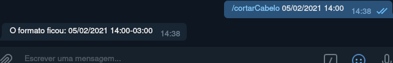

Há a possibilidade de inserção de novos formatos de data e horário quando houver o envio da mensagem para o _bot_.

A data pode ser expressa das seguintes formas:

- ano-mes-dia: 2016-06-20
- ano/mes/dia: 2016/06/20
- mes/dia/ano: 06/20/2020
- dia.mes.ano: 20.06.2020

A hora pode ser expressa de duas formas:

- hora\[24h\]:minuto: 17:26
- hora\[12h\]:minuto\[espaço\]\[AM/PM\]: 5:26 PM

A forma escolhida para prosseguirmos com a construção da aplicação é a seguinte:

dia.mes.ano para data. hora:minuto\[12h\] para horário.

Logo, uma forma de marcar o evento pode ser:

/cortarCabelo 01.02.2021 15:00

## ADICIONANDO O _GOOGLE CALENDAR_

Agora, deve-se colocar o bloco que adiciona o evento no _Google_ Calendar.

 Configurando o bloco _Google Calendar_

Selecione o bloco _Create an Event_ e posicione-o entre o bloco _Set variable_, onde foi criada a variável _toCalendar_, e o bloco _Send a text message or a Reply_ do _Telegram_, como na imagem abaixo:

 Disposição dos blocos após a adição do _Google Calendar_

Agora vamos configurar o _Google Calendar_ - _Create an Event_.

Após clicar nele, no campo _Connection_, pressione _Add_.

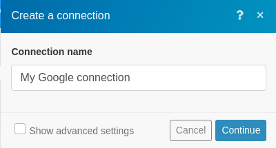 Estabelecendo a conexão entre a aplicação e a conta no _gmail_

Depois de clicar em _Continue_, haverá a abertura de uma janela destinada a receber as informações da conta _Google_ e conectar o Calendário _Google_ ao _Integromat_.

Em seguida, é necessário preencher os seguintes campos:

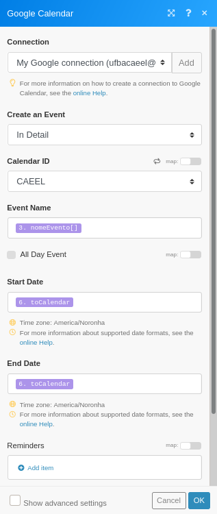

Em _Calendar ID_, selecione o calendário onde o evento será adicionado. Caso esse seja o primeiro calendário criado, deve-se pressionar a opção _Primary Calendar_.

Em _Event Name_ coloque a variável criada anteriormente nomeEvento.

Em _Start Date_ e _End Date_ coloque a variável _toCalendar_.

## AJUSTES FINAIS

Depois dessa etapa, o _bot_ está pronto para uso. Apesar dele já estar funcionando normalmente, é preciso adicionar uma mensagem no último bloco de modo a garantir e certificar de que o _bot_ emita um alerta de sucesso como “Evento adicionado”.

 Configuração da confirmação do evento

Vamos ver se o evento está finalmente sendo criado agora?

Salve a aplicação e aperte o botão _Run Once_. Feito isso, converse com o seu _bot_ no _Telegram_ de modo a enviar as informações do evento.

Parece que funcionou, certo? Vamos observar se o evento foi criado!

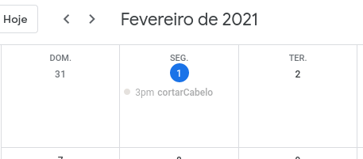 Evento criado no _Google Calendar_

Como pode ser visualizado na figura acima, o evento foi adicionado no _Google Calendar_ no dia e hora em que especificados ao _bot_. A fim de que esse funcionamento permaneça de forma ininterrupta, é necessário ligar o _bot_ para que ele funcione sem a necessidade de pressionar o _Run Once_ a cada execução. Para isso, é preciso ligá-lo no botão-chave, localizado logo abaixo do botão _Run Once_.

 

Após isso, é possível definir um nome para a integração no canto superior esquerdo, clicando sobre o nome e alterando seu valor.

Posteriormente, salve o seu projeto para finalizar clicando no disquete na aba _Controls_.

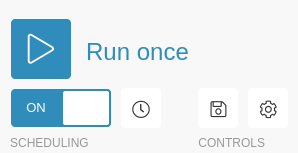 Salvando o projeto

Ao receber a mensagem de confirmação, é possível retornar à página inicial e o bot criado já está funcionando. Assim, a criação de eventos no _Google_ Agenda pode ocorrer pela comunicação com o _bot_ pelo _Telegram_.

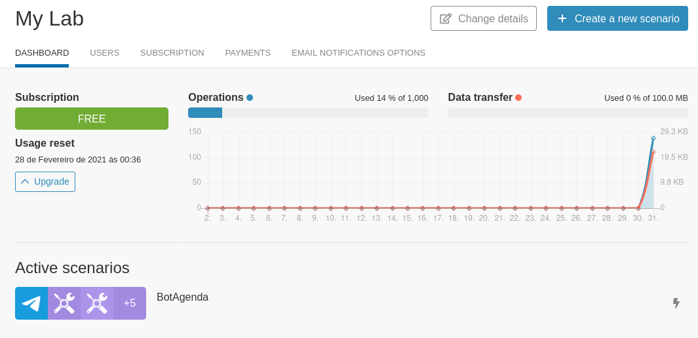 Checagem do funcionamento

Ressalta-se que, se houver algum erro de escrita ou formatação durante a troca de mensagens com o _bot_, será necessário ativá-lo novamente no _Integromat_. Isso se deve ao fato de que, para não aumentar a complexidade da aplicação, não houve o desenvolvimento de uma possibilidade para tratar erros.

## ETAPAS PARA O DESENVOLVIMENTO DA APLICAÇÃO

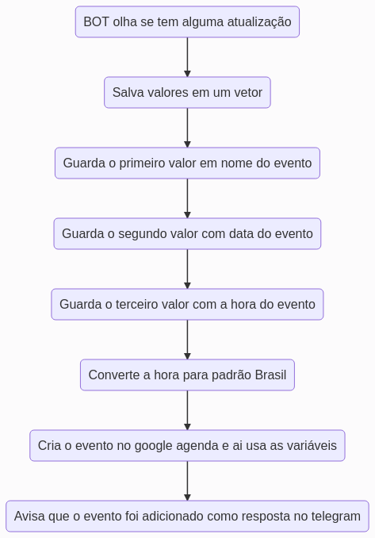

## CONCLUSÃO

A partir desse manual, o(a) leitor(a), independente do nível de conhecimentos prévios, pode compreender o que são os _bots_, bem como a capacidade desse tipo de aplicação em solucionar problemas estruturados, programáveis e parametrizados. Além disso, o(a) leitor(a) consegue desenvolver um robô virtual capaz de reduzir uma atividade mecânica para o envio de uma mensagem no chat específico.

Apesar do manual inserir os robôs virtuais em um contexto específico (adicionar eventos na _Google_ Agenda), o procedimento para construir outros _bots_, que possam exercer funções distintas, segue as mesmas diretrizes apresentadas quando se faz uso de uma integração entre o _Integromat_ e o _Telegram_.

Por fim, não se esqueça de comentar sobre nossa publicação, colocar as suas dúvidas e nos trazer sugestões para _posts_ futuros.

## REFERÊNCIAS

\[GUIA Completo\] Chatbot: o que é, como funciona, benefícios e cases. \[S. l.\], 30 out. 2019. Disponível em: [https://take.net/blog/chatbots/chatbot](https://take.net/blog/chatbots/chatbot). Acesso em: 1 fev. 2021.

Tutorials | Integromat. \[S. l.\], 2012. Disponível em: [https://www.integromat.com/en/kb/tutorials.html](https://www.integromat.com/en/kb/tutorials.html). Acesso em: 1 fev. 2021.

Telegram API. \[S. l.\], 2013. Disponível em: [https://core.telegram.org/api](https://core.telegram.org/api). Acesso em: 1 fev. 2021.
