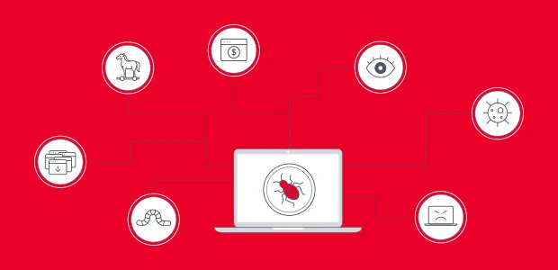

A Engenharia Social consiste na capacidade de obtenção dos dados e informações confidenciais através de falhas associadas ao sistema ou ao desconhecimento de práticas que possam favorecer à navegação segura do usuário. Essa prática ilegal já existia nos tempos em que as tecnologias ainda não estavam tão presentes no cotidiano da maioria das pessoas. Assim, muitos golpes podiam ocorrer através de ligações de falsos atendentes, exigindo o fornecimento de informações pessoais, como senhas bancárias.  Com o crescimento das redes sociais e de sistemas envolvendo transações financeiras, os ataques dos cibercriminosos também se tornaram mais recorrentes. A segurança da informação busca evitar esse roubo de dados além dos danos aos equipamentos e _softwares_ associados.

## Princípios de segurança

O principal objetivo da segurança da informação é promover a confiabilidade. Além disso, há ainda os seguintes princípios de segurança:

Princípios da segurança da informação

#### **Disponibilidade**

A garantia de que as informações sempre possam ser acessadas pelos usuários autorizados depende que o sistema esteja disponível para uso. Para isso, algumas alternativas podem ser usadas, como o _nobreak_ o qual regula a voltagem evitando danos se houver picos energéticos e alimenta o circuito em caso de queda de energia e o _backup_ que permite a recuperação de dados a partir da cópia de arquivos. Além disso, é importante se atentar para a validade do hardware, fazendo as devidas substituições quando necessário. Tais equipamentos substitutos estão inclusos no grupo do _backup_ físico

#### **Integridade**

Esse princípio visa garantir que as informações não sejam modificadas e se faz presente a partir do uso de senha, biometria, assinatura e certificado digital.

#### **Autenticidade**

Busca certificar que a informação enviada tenha uma origem conhecida. Isso pode ser garantido através de senha, biometria, assinatura e certificado digital.

#### **Confidencialidade**

Evita que a informação enviada seja lida por terceiros, refere-se à privacidade do conteúdo. Essa propriedade pode ser garantida por meio da criptografia.

#### **Irretratabilidade**

Garante que um transmissor não pode negar o envio de uma informação, assim como um receptor não pode negar seu recebimento.

## Políticas de segurança

Documentação de cumprimento obrigatório pelos membros da empresa a qual apresenta os aspectos que garantem a segurança da organização. Estes estão subdivididos em:

#### **Acesso físico**

Referente à segurança física da empresa e de seus sistemas, a exemplo dos extintores de incêndio, câmeras de segurança, acesso ao_data center_, entre outros.

#### **Acesso lógico**

Associa-se às propriedades lógicas do sistema, responsável pela segurança do _software_, como o antivírus e o _firewall_. Ou seja, percebe-se que uma opção segura para prevenção contra os _malwares_ é ter ambos operando em conjunto.

#### **Rastreadores de acesso**

Indica o monitoramento parcial ou total do acesso dos colaboradores da empresa aos sistemas da organização, estabelecendo restrições de uso para determinadas informações e sites, por exemplo. Ressalta-se que esse monitoramento não é considerado ilegal se estiver previsto na política de segurança da organização.

_Data center_

## Ferramentas de proteção

#### **Antivírus**

Trata-se de uma ferramenta que permite o rastreamento e o combate às principais pragas virtuais, conhecidas como _malwares_. Ou seja, apesar do que seu nome indica, os antivírus não protegem a máquina somente contra os vírus. Ao realizar a sua instalação, um banco de dados é criado dentro do qual há o cadastro de um certo número de pragas virtuais, somente ocorrerá a detecção desses _softwares_ malignos catalogados. Normalmente, com a atualização do programa, o catálogo é aumentado e mais códigos maliciosos podem ser combatidos, aumentando a segurança do sistema.

A detecção de _malwares_ é feita a partir da análise comportamental do sistema. Desse modo, ao executar um arquivo, o antivírus faz uma análise da sua rotina e, caso detecte que seu comportamento está diferente do esperado, há o bloqueio de sua execução e de sua propagação pelo computador.

#### **_Firewall_**

O _firewall_ é um mecanismo que contribui para a proteção do computador e controla a entrada e saída de pacotes IP, TCP e UDP da rede. Seu funcionamento se dá por meio da atribuição de especificações capazes de filtrar pacotes e bloquear tentativas de acessos não autorizados. A partir do estabelecimento dessas regras, o _firewall_ é capaz de barrar a entrada de _malwares_, mas não é responsável por sua eliminação em caso de entrada na máquina.

Com isso, o _firewall_ não deve ser confundido com o antivírus uma vez que ele não consegue detectar e combater um software maligno diretamente. Porém, um _firewall_ pode impedir a entrada de uma praga virtual de maneira indireta, evitando a entrada de um arquivo que esteja infectado caso esse se encaixe nas regras estabelecidas para a filtragem. A configuração mais indicada para essa ferramenta consiste no bloqueio do conteúdo de entrada e liberação de conexões específicas de saída.

Ferramentas de proteção

## _Malwares_

#### **Vírus**

O vírus é a parte de um programa presente em algum dispositivo (computadores, celulares, notebooks), normalmente malicioso, que se propaga pela inserção de auto-cópias, tornando-se parte de outros _softwares_ e arquivos hospedeiros. Como consequência, quando ocorre a execução do arquivo infectado, o código do vírus também inicia sua disseminação através da máquina. Um vírus é capaz de apagar dados, promover travamentos, tornar a máquina lenta, apresentar avisos indesejados, transformar os arquivos em atalhos, entre outros. Para combatê-lo, é necessário que o antivírus instalado consiga fazer seu reconhecimento a partir do banco de dados disponível.

#### **_Worm_**

Consiste em um _malware_ capaz de se propagar automaticamente pelas redes, enviando auto-cópias entre computadores. Seus objetivos são parecidos com os dos vírus, por exemplo: danificar a máquina, prejudicar o uso de algumas funcionalidades, entre outros. Uma das principais características que permitem sua distinção com os vírus reside no fato de que essa praga virtual é classificada como autossuficiente, enquanto o vírus não apresenta essa propriedade. Ou seja, o _worm_ pode ser percebido na máquina de maneira direta e normalmente se apresenta como um arquivo executável suspeito. Por outro lado, um vírus depende de um hospedeiro para ser enxergado.

É importante ressaltar que um _worm_ não contamina arquivos executáveis ou programas do computador. Como esse _malware_ já consiste em um arquivo desse tipo, ele realiza a infecção do sistema operacional ou da rede do computador. Isso é feito a partir da autorreplicação do arquivo e de sua sucessiva reprodução até promover o travamento do sistema pelo excesso de execuções.

#### **_Bot_**

O _bot_ é uma praga virtual que dispõe de mecanismos que possibilitam a comunicação contínua com o invasor e permitem, com isso, o controle remoto das ações do programa maligno. Esse código malicioso é frequentemente usado em ataques e possui um processo de infecção similar ao _worm_, capaz de se propagar automaticamente, aproveitando as vulnerabilidades presentes nos _softwares_ instalados.

#### **_Trojan_** **ou Cavalo de Tróia**

O _trojan_ é um programa disfarçado que pode ser introduzido em um computador para assumir o controle do sistema. Inicialmente, ele costuma desativar os sistemas de proteção da máquina, como o _firewall_ e o antivírus. Após tal vulnerabilidade, o responsável pelo _malware_ pode se conectar com o computador e ter acesso total a seus recursos. A contaminação por _trojans_ pode ser prevenida, evitando-se a conexão de _pen-drives_ em computadores de uso público, como os de uma _lan-house_, e a instalação de _softwares_ pirateados.

#### **_Backdoor_**

O backdoor é um praga virtual que permite o retorno do invasor a um computador infectado a partir da inclusão ou mudança de funcionalidades. Dessa forma, ocorre a habilitação de serviços que permitem a entrada do atacante novamente, o qual se aproveita sobretudo de sistemas operacionais desatualizados.

#### **_Spyware_**

Antes de tratar sobre o _spyware_, é importante explicar o conceito de _cookies_. Quando um usuário acessa um site, há o armazenamento de um arquivo chamado de _cookies_. Ao fechar o navegador, esse _cookie_ é salvo na máquina como arquivo temporário e, em caso de retorno ao site, o servidor recarrega o _cookie_, reconhecendo o perfil do internauta. Aproveitando-se disso, o _spyware_ é um programa que monitora as atividades de um sistema e envia as informações adquiridas ilegalmente para terceiros e para o criador desse _software_ maligno. Portanto, é possível que haja o envio de propagandas referentes aos _cookies_ para preenchimento de formulários e, por conseguinte, o roubo dos dados pessoais do usuário.

#### **_Keylogger_** **e** **_screenlogger_**

O _keylogger_ é um _malware_ capaz de capturar, armazenar as teclas digitadas pelo usuário no teclado do computador e enviá-las para o criador da praga virtual. Esse recurso normalmente é usado para a obtenção de senhas enquanto os internautas navegam por sites de comércio eletrônico ou internet _banking_. Após os ataques através do _keylogger_ se tornarem cada vez mais frequentes, muitos sites de comércio online começaram a fazer uso de um teclado virtual mostrado na tela onde a senha é inserida a partir dos cliques com o mouse. Porém, foi desenvolvida uma forma de vulnerabilizar esse sistema através do _screenlogger_, capaz de armazenar através de _prints_ na tela a posição do cursor e a tela apresentada quando o mouse é clicado e enviar as imagens para o dono desse _malware_; obtendo, com isso, a senha do usuário. Outra praga virtual análoga é o _weblogger, o_ qual permite que o _cracker_ acesse a _webcam_ do computador e possa filmar o conteúdo exibido, invadindo a privacidade do usuário.

Teclado virtual

#### **_Adware_**

O _adware_ tem seu funcionamento dependente do processo de espionagem, pois foi projetado para exibir propagandas direcionadas conforme a navegação do usuário sem que ele possa consentir a respeito de tal monitoramento. Normalmente, essas propagandas são mostradas através de janelas _pop-up_ maliciosas as quais conduzem o usuário até uma praga virtual. Ressalta-se que as propagandas nem sempre são criminosas uma vez que os anúncios incorporados a programas como patrocínio ou referente ao retorno financeiro de aplicativos gratuitos são permitidas legalmente.

#### _**Hijacker**_

O _hijacker_ atua nos navegadores com a modificação da página inicial e a sua barra de ferramentas, pelo impedimento do acesso aos sites de antivírus e forçando o usuário a visitar páginas indesejadas a fim de promover tráfego e publicidade. Ele costuma se instalar de modo furtivo nos computadores a partir de _softwares_ de origem suspeita.

#### **_Rootkit_**

O _rootkit_ pode ser definido como um conjunto de _softwares_ e técnicas que permite esconder e assegurar a presença de um invasor ou código suspeito em um computador comprometido. Pode ser usado para instalar programas maliciosos, como o _backdoor_, assegurando o acesso futuro à máquina, para esconder atividades e informações, arquivos, diretórios, processos, chaves de registro, conexões de rede, entre outros. Esse apagamento de arquivos inclui relatórios gerados pelo servidor com a intenção de dificultar a detecção desse _malware_.

O _backdoor_ e o _rootkit_ são inseridos por um _cracker_ através da execução de um programa malicioso, exploram as vulnerabilidades da máquina e criam condições para o retorno do criminoso. Porém, apesar das semelhanças, somente o _rootkit_ altera e remove arquivos e promove a instalação de outros _softwares_ ou arquivos de procedência duvidosa.

#### **_Ransomware_**

O _ransomware_ é um código malicioso que remove o acesso aos dados armazenados em uma máquina. Para isso, ele normalmente criptografa a maioria (ou todos) os arquivos do computador e exige a realização de um pagamento para que o usuário possa recuperar o acesso. Uma importante maneira de prevenção contra esse _malware_ consiste em fazer atualizações frequentes no _backup_, sobretudo dos arquivos mais relevantes.

Tipos de _Malwares_

## Golpes e ataques virtuais

#### **_Phishing_**

O _phishing_ é um tipo de golpe virtual onde o cracker busca obter dados pessoais e financeiros pelo uso combinado de meios técnicos e engenharia social. Esse processo ocorre através de propagandas, e-mails, sites falsos que são usados para atrair o usuário vítima a fim de que haja o fornecimento de suas informações pessoais.

#### **_Pharming_**

O _pharming_ pode ser considerado um tipo específico de _phishing_ envolvendo o direcionamento da navegação do usuário para sites falsos por meio de alterações no serviço de Sistema Nome de Domínio (DNS). Desse modo, quando a vítima tentar o acesso a um site, a navegação será redirecionada imperceptivelmente para uma página falsa. Assim, nesse ambiente clonado, haverá a requisição e roubo dos dados pessoais do usuário.

#### _**DOS**_

A técnica _DOS_ se baseia na negação de um serviço e ocorre quando um atacante usa uma máquina para tirar de operação um serviço, um computador ou uma rede conectada à internet. Quando esse ataque é feito de forma coordenada e distribuída ao longo de um conjunto de computadores, trata-se de do _DDOS_. Esse consiste no ataque simultâneo por muitas máquinas sobre controle do invasor.

Golpes e ataques virtuais

## Conclusão

Portanto, é perceptível a importância da preocupação com a segurança de dados a nível individual e coletivo. Em busca dessa garantia, algumas práticas devem ser evitadas pelos usuários durante sua navegação. A exemplo delas: o acesso a páginas classificadas como não seguras, o _download_ de programas pirateados e de procedência duvidosa e o fornecimento de dados pessoais para sites sem certificação digital. Ademais, é de suma importância que o usuário mantenha o _firewall_ de sua máquina com as configurações recomendadas e o seu antivírus atualizado para se prevenir da contaminação por _malwares_ e dos golpes e ataques virtuais.

## Referências

GRAN cursos Online. _In_: **Gran cursos Online**. \[_S. l._\], 2018. Disponível em: <https://www.grancursosonline.com.br/>. Acesso em: 5 fev. 2021.

A ENGENHARIA para enganar pessoas. \[_S. l._\], 23 dez. 2013. Disponível em: <https://www.kaspersky.com.br/blog/engenharia-social-hackeando-humanos/1845/>. Acesso em: 23 mar. 2021.
