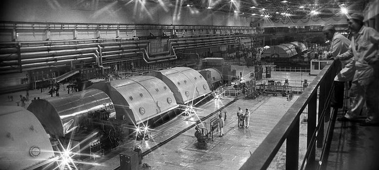
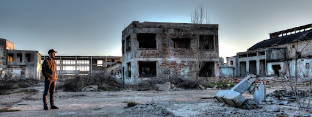
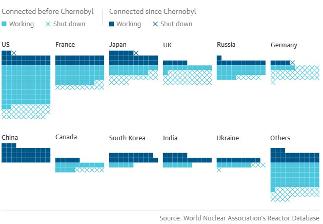

O desastre de Chernobyl é considerado o maior acidente nuclear da história da humanidade e as suas consequências se estendem mesmo 35 anos após o ocorrido. Os resultados do desastre vão desde consequências diretas como lugares inabitados por conta da radiação, a impactos indiretos como o fortalecimento de movimentos anti-nucleares.

A Central Nuclear operava com quatro reatores capazes de gerar até 1000MW que alimentavam, cada um, dois geradores de energia elétrica. Os reatores que compõem a usina são do tipo RBMK (_Reaktor Bolshoy Moshchnosty Kanalnyy_**)** ou Reator Canalizado de Alta Potência devido, sobretudo, aos seus canais pressurizados. Com um plano inovador para a época, derivado de projetos antecessores os quais tinham como objetivo a criação de uma arma nuclear, os reatores eram refrigerados à água com canaletas individuais de combustível passando por dentro de blocos de grafite que, além de moderadores, atuavam como elementos estruturais do núcleo.

Geradores de energia elétrica da usina nuclear de Chernobyl

## O teste que infringiu protocolos de segurança, demonstrou erros de projeto e sucedeu a tragédia

Sala de controle do 4º reator da Usina Nuclear de Chernobyl

No dia 26 de Abril de 1986, uma manutenção de rotina estava agendada para acontecer na unidade 4 da Central Nuclear Lênin de Chernobyl e os engenheiros aproveitaram a ocasião para realizar uma manobra de testes. Com isso, o equipamento foi submetido a um procedimento capaz de simular a falta de energia na estação e os sistemas de segurança de emergência e regulagem foram desligados intencionalmente. Esse teste expôs uma sequência de falhas as quais incluíam desde incoerências no projeto do reator até indícios de que os operadores da usina infringiram protocolos de segurança, como a utilização de poucas hastes de controle e a inativação do sistema de desligamento automático do reator em caso de baixo nível de água. Além disso, o Relatório INSAG-7 (1992) do Grupo Consultivo de Segurança Nuclear Internacional registrou que dentre as principais causas do desastre encontravam-se peculiaridades físicas desconhecidas pelos operadores e construtores.

Dentre as peculiaridades desconhecidas pelos operadores se destaca o **coeficiente de vazio de reatividade** perigosamente alto, esse índice diz respeito à diferença de reatividade que um reator nuclear possui em relação a sua operação no vácuo. O reator escolhido operava com coeficiente positivo por causa da presença de bolhas de ar e uso de grafite sólido como moderador, aumentando a potência e tornando o reator altamente instável quando operava em níveis baixos de potência.

Apesar de produzir energia elétrica, as centrais nucleares também precisam de um Sistema Elétrico de Potência capaz de suprir as necessidades energéticas dos seus equipamentos e, como forma de segurança e alternativa a uma falta de energia, ainda apresentam geradores de emergência. No teste realizado no dia 26 de abril, os engenheiros buscaram avaliar se, após uma queda abrupta de energia, as turbinas seriam capazes de girar e manter as bombas de circulação refrigerando o reator a tempo de haver a ligação dos geradores a diesel.

Desde 1982, três testes anteriores haviam sido executados com intuito de criar um procedimento de segurança para manter o núcleo do reator resfriando quando ocorressem cortes de energia até que os geradores de _backup_ fossem ligados. Tais testes falharam em trazer uma solução para o problema, ocasionando o desastre. Durante a preparação para o teste elétrico a potência do reator despencou de forma inexplicada para um valor próximo a 0, os operadores só podiam restaurar parte da potência definida pelo teste, o que resultou em condições instáveis. Porém, o risco não era evidente pelas instruções de operação e o teste continuou. Ao fim do quarto teste, o desligamento do reator, fez com que a combinação das condições instáveis e falhas no design do reator ocasionasse uma reação nuclear descontrolada e em cadeia.

“O equívoco da prática de transferir funções de proteção de emergência para o operador humano, devido à falta de recursos de segurança de engenharia adequados, foi elevado pelo próprio acidente: a combinação de deficiências de projeto e a confiabilidade não total dos operadores humanos ocasionou o desastre .” _- INSAG-7: The Chernobyl Accident: Updating of INSAG-1_ (Traduzido do Inglês)

## O pós desastre e os impactos do acidente na aceitação da tecnologia nuclear

O anúncio oficial tardio do acidente para o público demonstra também o descuido e a negligência, expondo mais pessoas ao risco e agravando a situação de emergência. O atraso se deu principalmente por motivos políticos, pois os soviéticos estavam inseridos no contexto da Guerra Fria e um acidente com tal magnitude colocaria em risco a soberania deles e aumentaria o preconceito referente às tecnologias nucleares. Por causa disso, os soviéticos, inicialmente, fizeram um anúncio minimizando a gravidade do ocorrido, mas por causa das proporções do acidente não foi possível esconder os danos reais.

Como consequência direta do desastre, a União Soviética registrou oficialmente 31 mortes como resultado imediato e é estimado pela _World Health Organisation_ um número de 9 mil mortes indiretas causadas até o ano de 2005. Além disso, houve o surgimento da zona de exclusão de Chernobyl a qual recebe esse nome por ser a região ao redor do reator com raio de até 30 km onde o índice de radiação elevado tornou a área praticamente inabitada, exceto pela pequena população de Samosely que vem diminuindo ao longo do tempo.

Cidade de Chernobyl após o acidente

Com o ocorrido em Chernobyl, os outros acidentes nucleares, como os de Tokaimura em 1999 e Fukushima em 2011, e o seu potencial altamente destrutivo, quando utilizado para fins bélicos, a aceitação e o apoio para o desenvolvimento da tecnologia nuclear têm sido enfraquecidos internacionalmente.

Outrossim, a amostra de dados abaixo, publicados pelo _World Nuclear Association’s Reactor Database,_ demonstra que, 32 anos antes do acidente de Chernobyl, 409 reatores foram abertos, mas apenas 194 foram  mantidos nas três décadas posteriores.

Dados da pesquisa feita pela _World Nuclear Association’s Reactor Database_

## Energia nuclear: uma alternativa promissora marcada por tragédias recentes

Entretanto, ressalta-se que as usinas nucleares oferecem um importante potencial energético, sendo possivelmente uma das melhores alternativas para substituir as fontes não limpas de energia por conta, sobretudo, da abundância do urânio (elemento essencial na produção da energia nuclear) e da não utilização de combustíveis fósseis, ou seja, não há emissão de gases que contribuem com o aquecimento global. Além disso, não há a dependência das condições climáticas e uma significativa redução de custos quando comparada a outras alternativas energéticas. Assim, desde que operadas com o rigor e competência necessários para garantir a segurança das pessoas envolvidas no processo, a energia nuclear é uma alternativa viável. Por fim, o desastre de Chernobyl deve servir como alerta para não se negligenciar e tolerar erros e falhas em nenhum estágio de um projeto ou tecnologia, principalmente quando há o risco à integridade física dos envolvidos.

## Referências

ACIDENTE NUCLEAR DE CHERNOBYL. Disponível em: < [https://pt.wikipedia.org/wiki/Acidente\_nuclear\_de\_Chernobil](https://pt.wikipedia.org/wiki/Acidente_nuclear_de_Chernobil)\>. Acesso em: 25/04/2021

CHERNOBYL DISASTER. Disponível em: <[https://en.wikipedia.org/wiki/Chernobyl\_disaster](https://en.wikipedia.org/wiki/Chernobyl_disaster) >. Acesso em: 25 de Abril de 2021. BEALE, Charlotte. HAS THE CHERNOBYL DISASTER AFFECTED NUMBER OF NUCLEAR PLANTS BUILT. The Guardian. Disponível em: <[https://www.theguardian.com/environment/2016/apr/30/has-chernobyl-disaster-affected-number-of-nuclear-plants-built](https://www.theguardian.com/environment/2016/apr/30/has-chernobyl-disaster-affected-number-of-nuclear-plants-built) >. Acesso em: 25 de Abril de 2021. [Blix, H., 1986. The post-Chernobyl outlook for nuclear power. Nuclear industry, 6(8), pp.17-20.](https://www.iaea.org/sites/default/files/28304780912.pdf) Acesso em: 25/04/2021

INTERNATIONAL NUCLEAR SAFETY ADVISORY GROUP, The Chernobyl Accident: Updating of INSAG-1, INSAG-7, IAEA, Vienna (1992).

WHAT was the death toll from Chernobyl and Fukushima?. \[_S. l._\], 24 jul. 2017. Disponível em: <https://ourworldindata.org/what-was-the-death-toll-from-chernobyl-and-fukushima>. Acesso em: 1 jun. 2021.
